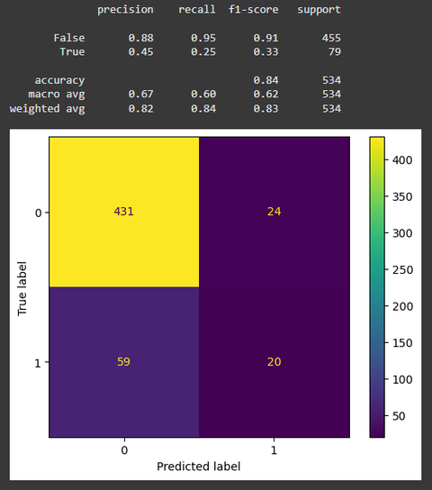
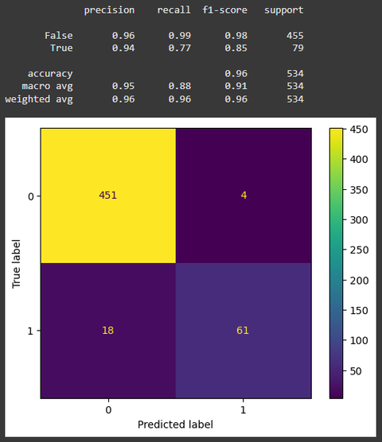

# Customer Churn Prediction 📉📡

A Machine Learning project for predicting customer churn in a telecommunication company. The goal is to identify customers who are likely to cancel their subscription and help the company take proactive actions to retain them.

## 🔍 Project Overview

Customer churn is a critical issue in the telecom industry. Retaining existing customers is often more cost-effective than acquiring new ones. This project applies machine learning techniques to analyze historical customer data and predict churn behavior.

**Key objectives:**
- Preprocess and explore customer data  
- Apply Logistic Regression and XGBoost models  
- Evaluate model performance using various metrics  
- Generate insights for churn reduction strategies

## 🗂️ Repository Structure

```
├── Copy of churn-bigml-20.csv
├── Copy of churn-bigml-80.csv
├── Customer's_Churn_Prediction_ML_Models.ipynb
├── logistic_results.png
├── xgboost_results.png
└── README.md
```

## 🧠 Models Used

- **Logistic Regression** — a simple, interpretable linear model for binary classification  
- **XGBoost** — a powerful tree-based boosting algorithm known for high performance

## 📊 Dataset

The datasets used (`churn-bigml-20.csv` and `churn-bigml-80.csv`) include:
- Demographic info  
- Account status  
- Usage patterns  
- Service types  
- Target label: `Churn` (Yes/No)

## 📈 Evaluation Metrics

- Accuracy  
- Precision, Recall, F1-Score  
- ROC-AUC Score  
- Confusion Matrix  

These were used to assess and compare the performance of both models.

## 🚀 How to Run

1. Clone this repo:
   ```bash
   git clone https://github.com/ItsVinh-dotcom/Customer-s-Churn-Prediction.git
   ```
2. Open `Customer's_Churn_Prediction_ML_Models.ipynb` in Jupyter or Google Colab  
3. Run all cells to train, evaluate models and view results

## 💡 Results & Insights

- **XGBoost** outperformed Logistic Regression in most metrics  
- Key churn indicators:
  - `International Plan`
  - `Customer Service Calls`
  - `Total Day Minutes`

### 📌 Model Performance Comparison

#### Logistic Regression  


#### XGBoost  


> *XGBoost shows stronger performance in classifying churned customers with higher recall and precision.*

### 📢 Business Recommendations

- Improve support quality and reduce complaint resolution time  
- Monitor users with high day-time usage and international plans  
- Launch retention campaigns for high-risk segments

## 🔧 Future Work

- Feature selection and hyperparameter tuning  
- Cross-validation for robustness  
- Deploy model as API or dashboard (Flask/Streamlit)

## 👨‍💻 Author

**ItsVinh-dotcom**  
Drop a ⭐ if you like this project or open an issue if you’ve got suggestions!
